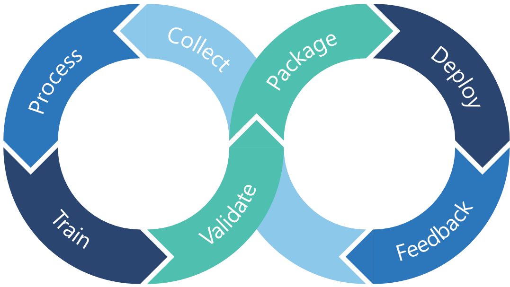
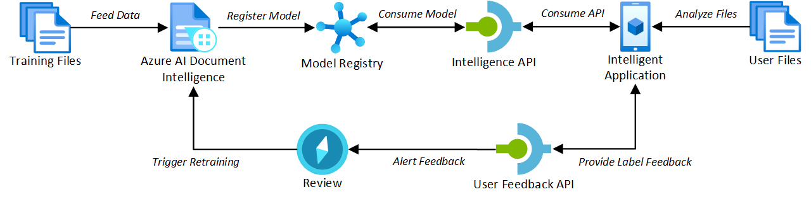
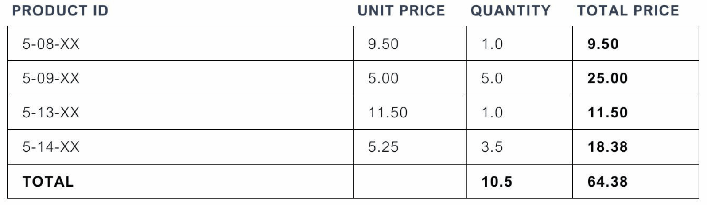

# Azure Document Intelligence Custom Template User Feedback Loop Experiment

This experiment demonstrates how to replicate the functionality of the [Azure AI Document Intelligence](https://learn.microsoft.com/en-GB/azure/ai-services/document-intelligence/overview) Studio custom model training process to showcase how to create a user feedback loop for improving the quality of document processing results.

The provided [Sample Python notebook](./Sample.ipynb) showcases a more interactive user feedback experience, enabling a user to draw over an uploaded, analyzed document to provide feedback on the quality of results by highlighting incorrect or missing information with corrections. This implementation could be replicated in any client application using your chosen framework capabilities.

The goal is to showcase how a feedback mechanism can be implemented to allow the developers of custom models in Azure AI Document Intelligence to collect feedback from users to improve the model with the ability to retrain.

## Flow

This experiment adapts the concepts of MLOps for machine learning projects to the domain of Azure AI Document Intelligence. 



The focus of the experiment is purely on the **Feedback, Collect, Process, [re]Train** stages. However, additional stages are loosely represented in the experiment.

For a more technical adaptation of this in practice for Azure AI Document Intelligence, the following diagram represents the flow of the experiment:



> [!NOTE]
> This experiment does not represent the entire technical diagram. Strategic guidance for implementing this technical approach can be found in the [Implementing MLOps for Training Custom Models with Azure AI Document Intelligence](https://techcommunity.microsoft.com/t5/fasttrack-for-azure/implementing-mlops-for-training-custom-models-with-azure-ai/ba-p/4072972) article.

### Setting the stage

- The [training files](./model_training/) are provided to Azure AI Document Intelligence using the [Azure SDK for Python](https://pypi.org/project/azure-ai-formrecognizer/) to build a custom model. These are uploaded to an Azure Storage blob container. This represents the work that would be completed as part of the **Collect**, **Process**, and **Train** stages of the MLOps process.
  - For the purposes of this experiment, these documents have already been analyzed and labelled using the Azure AI Document Intelligence Studio and are provided as a starting point for the experiment.
- The model is registered with Azure AI Document Intelligence using semantic versioning to provide a version to the model ID. We start with version `1.0.0`. This represents the **Package** stage of the MLOps process.

With the model registered, we continue to the **Feedback** stage and the purpose of this experiment.

### The user feedback loop

- The experiment provides a [sample user file](./pdfs/Invoice_6.pdf) that will be analyzed using the model in Azure AI Document Intelligence using the Python SDK. The results will be stored in an [analysis results file](./pdfs/Invoice_6.pdf.ocr.json) for later feedback submission.
- The user will provide feedback on the analysis by drawing over the document to highlight the areas for improvement.
  - For the purposes of this experiment, the document is not automatically labeled with the results of the analysis. This requires a user of the sample to mark all fields for feedback. In a real-world scenario, the document would be automatically labeled with the results of the analysis and the user would only need to mark the fields that require feedback.
- Once the user has marked the document, they can correct the field location and text content. This information is stored in a [feedback file](./pdfs/Invoice_6.pdf.labels.json) for later submission.
  - This feedback file uses the [labels schema](https://schema.cognitiveservices.azure.com/formrecognizer/2021-03-01/labels.json) defined by Azure AI Document Intelligence.

Below is an example of the user interaction experience demonstrated in the notebook.



At this point, in a real-world scenario, the PDF, feedback file, and analysis results would be packaged and submitted for human review. You could then determine when to trigger the process for retraining. This step is not represented in the experiment.

- The feedback package is then submitted to the existing Azure Storage Blob container for the model. This represents looping back to the **Collect** and **Process** stage of the MLOps process.
- Again, the model training data, including the new feeedback, is processed using the Azure SDK for Python to incorporate the feedback to the model in Azure AI Document Intelligence. This represents the **Train** stage of the MLOps process.
- The model is registered with Azure AI Document Intelligence, following semantic versioning. This represents the **Package** stage of the MLOps process.
  - For the purposes of this experiment, the change we have introduced to the model is considered minor. This is because we have introduced new training data based on the current document template. The version of the model will now be `1.1.0`.

The experiment is complete, and the model is ready for use with the new feedback incorporated.

## Getting Started

### Prerequisites

- Install [**Visual Studio Code**](https://code.visualstudio.com/download)
- Install [**Docker Desktop**](https://www.docker.com/products/docker-desktop)
- Install [**Remote - Containers**](https://marketplace.visualstudio.com/items?itemName=ms-vscode-remote.remote-containers) extension for Visual Studio Code

> [!NOTE]
> If you are not planning on using the Dev Container, you must also install [**PowerShell Core**](https://docs.microsoft.com/en-us/powershell/scripting/install/installing-powershell), [**Azure CLI**](https://docs.microsoft.com/en-us/cli/azure/install-azure-cli), and [**Python**](https://www.python.org/) on your local machine, as well as the necessary Python packages from the [**requirements.txt**](./requirements.txt) file. This also includes the required tools, [Poppler](https://github.com/oschwartz10612/poppler-windows), [Tesseract](https://tesseract-ocr.github.io/tessdoc/Installation.html), and [OpenCV](https://opencv.org/releases/).

### Setup the Azure infrastructure

The Dev Container comes pre-configured with the necessary tools to deploy the Azure infrastructure in the [**main.bicep**](./infra/main.bicep) file. The infrastructure includes the following resources:

- Azure Storage Account
- Azure AI Document Intelligence

> [!IMPORTANT]
> You must run this step to deploy the infrastructure before running the sample notebook. The notebook will not work without the necessary Azure resources deployed.

To deploy the infrastructure, run the [`Deploy-Infrastucture.ps1`](./Deploy-Infrastructure.ps1) script from the terminal in Visual Studio Code when the Dev Container is running.

> [!NOTE]
> If you have not logged into the Azure CLI, you will need to run `az login --use-device-code` to authenticate from within the Dev Container. Running `az account set --subscription <subscription-id>` will also set the default subscription to the one you want to use if you have multiple subscriptions.

```powershell
./Deploy-Infrastructure.ps1
```

### Run the sample notebook

Before running the notebook, open the project in Visual Studio Code and start the development container. This will ensure that all the necessary dependencies are installed and the environment is ready to run the notebook.

Once the development container is running, open the [**Sample.ipynb**](./Sample.ipynb) notebook and follow the instructions in the notebook to run the experiment.